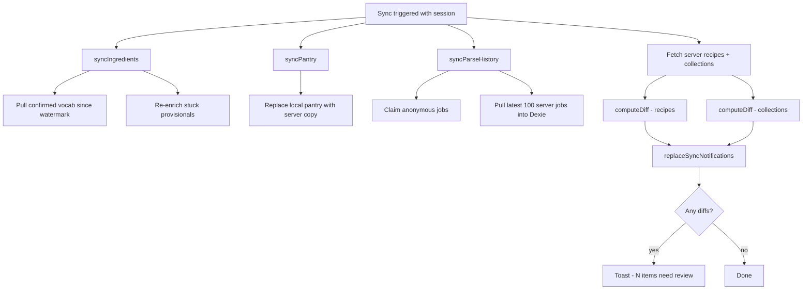

# Auth & Sync

How authentication works and how local data is reconciled with the server after sign-in.

---

## Authentication

RecipAI uses [better-auth](https://better-auth.com) with a Drizzle/Postgres adapter.

**Config:** `lib/auth/auth.ts`  
**Client:** `lib/auth/auth-client.ts`  
**API handler:** `app/api/auth/[...all]/route.ts`

### Providers

| Provider | Notes |
|---|---|
| **Google OAuth** | Requires `GOOGLE_CLIENT_ID` + `GOOGLE_CLIENT_SECRET`. |
| **Passkey (WebAuthn)** | Via `@better-auth/passkey`. |
| **Telegram OIDC** | Via `better-auth-telegram` (`providerId "telegram-oidc"`). Web login widget flow. Requires bot token + OIDC credentials. |
| **Telegram Mini App** | Via `better-auth-telegram` `miniApp` (`providerId "telegram"`). Silent `initData` sign-in inside the Telegram WebView — see [Telegram Mini App](telegram-mini-app.md). |

Account linking is enabled with `allowDifferentEmails: true` — a user can link multiple providers to one account.

**Unified Telegram identity.** OIDC (`telegram-oidc`) and Mini App (`telegram`) sign-ins resolve to one user: the Mini App path looks up an existing user by `user.telegramId`, and `oidc.mapOIDCProfileToUser` stamps `telegramId = claims.sub` onto OIDC users. The bot webhook (`/api/telegram-bot`) matches both providers.

### Session gating in API routes

Use `requireSession()` from `lib/auth/require-session.ts`:

```ts
const authed = await requireSession();
if (authed.response) return authed.response; // 401
// authed.session is typed and non-null here
```

Never inline `auth.api.getSession` + a manual null check. Routes that intentionally allow anonymous access (e.g. `GET /api/ingredients`, `GET /api/parse-queue/[id]`) skip `requireSession` by design.

### Session state flag

`lib/auth/session-state.ts` exports `isSignedIn()` — a module-level boolean updated by `useSyncOnLogin` whenever the session changes. This lets `syncFetch` skip fire-and-forget calls when the user is not signed in, avoiding 401 noise from local-only writes.

### PWA Google sign-in & linking (external browser)

An installed PWA's in-app browser has none of the user's saved Google accounts, so signing in or linking Google *inside* the PWA shows an empty account picker. Both flows route the user out to their **real** browser and reconcile through the shared Postgres DB. The app origin **must differ** from `NEXT_PUBLIC_EXTERNAL_AUTH_URL` (the external-auth origin) — see [gotchas](../reference/gotchas.md).

**Files:** `components/login-view` (sign-in) · `components/profile-auth` (linking) · `lib/auth/external-auth-flow.ts` (device protocol + session exchange) · `lib/auth/external-browser.ts` (open / copy / share / full-reload helpers) · `lib/auth/pending-device-auth.ts` (reload survival) · `lib/auth/external-link-plugin.ts` + `external-link-client.ts` (handoff endpoints) · `app/external-auth/*` (pages opened in the real browser).

**Sign-in — device authorization grant**

1. PWA calls `/device/code` → `device_code` + `user_code`, saved to `localStorage` so it survives the iOS PWA reload-on-foreground.
2. User opens the verification URL in their real browser (**Share** on iOS — `window.open` can't escape the in-app browser), signs in with Google, and approves (`/device/approve` sets `status = approved` + `user_id`).
3. PWA polls `/device/token`. On approval better-auth deletes the row and returns the session token as `access_token` — **but sets no cookie** (bearer grant).
4. PWA exchanges that token for a real cookie via `POST /external-link/device-session` (`establishDeviceSession`), then does a **full-page reload** to recipes (`completeDeviceSignIn`) so the app re-reads the fresh cookie. A soft client-side nav would keep the stale signed-out state and land on the login card.

**Linking — one-time handoff token**

1. Signed-in PWA calls `POST /external-link/generate` → a hashed one-time token (stored in `verification`, tied to the current user).
2. User opens the link page in their real browser; it redeems the token (`/external-link/redeem` → temporary session cookie on the external origin), runs `linkSocial({ provider: "google" })`, then `/external-link/cleanup` deletes the temp session.
3. PWA polls `listAccounts()` until Google appears.

`linkSocial` can only attach an **unowned** provider. If the user already signed in with that provider as a separate standalone account, linking fails — see the duplicate-account note in [gotchas](../reference/gotchas.md).

---

## Reconciliation (`hooks/use-sync-on-login.ts`)

`useSyncOnLogin` is mounted **once, for the app's lifetime**, by `SyncProvider`
(`lib/sync-context.tsx`) in `ClientShell` — as a sibling of `PageStack`, not inside any single
page's subtree. This matters: mounting it from a page component (as it used to be, directly in
`RecipesPage`) would re-run the whole reconciliation — and the one-time migrations below it —
every time that page remounts (e.g. leaving and returning to the Recipes tab). Pages that need a
manual trigger (pull-to-refresh) call `useTriggerSync()` from the same file, which reads
`triggerSync` off context rather than re-invoking the hook.

`sync()` itself is single-flight: a call that arrives while one is already running (the initial
mount, a focus re-pull, and a manual `triggerSync()` can all race) returns the existing in-flight
promise instead of starting an overlapping second run — covering all five branches below, not just
the recipes/collections diff.

When a session appears, and again on the foreground/manual triggers described above, `useSyncOnLogin` runs a full reconciliation:



### What each sync does

**Ingredients** — pulls `confirmed` vocabulary entries updated since the stored watermark (`localStorage.ingredientsSyncedAt`). Also re-triggers enrichment for any `provisional` entries stuck for more than 5 minutes with fewer than 3 retries.

**Pantry** — replaces the local pantry entirely with the server copy (no diff — server is authoritative for pantry).

**Parse history** — first claims any anonymous parse jobs into the user's account, then pulls the latest 100 server-side jobs and merges them into Dexie `parseHistory`.

**Recipes + collections** — fetches both sides and runs `computeDiff` (from `lib/db/sync-diff.ts`). Conflicts are where `updatedAt` differs between local and server. All diffs (server-only, local-only, conflicted) are written to Dexie `notifications` and the user is shown a toast to review them.

---

## Diff engine (`lib/db/sync-diff.ts`)

```ts
computeDiff<T extends { id: string; updatedAt: Date }>(
  local: T[],
  server: T[],
): SyncDiff<T>
```

Returns four buckets:

| Bucket | Meaning |
|---|---|
| `serverOnly` | Exists on server, not locally |
| `localOnly` | Exists locally, not on server |
| `conflicted` | Same id, different `updatedAt` |
| `identical` | Same id, same `updatedAt` |

Conflict resolution strategy: **last-write-wins is not applied automatically** — the user resolves each conflict via the Sync Review page (`app/[locale]/sync-review/`).

---

## Fire-and-forget sync on writes (`lib/db/supabase-sync.ts`)

Every local recipe write calls `syncCreate`, `syncUpdate`, or `syncDelete` via `syncFetch`. These are non-blocking — they fire and the UI doesn't wait.

`syncFetch` (`lib/sync-fetch.ts`) gates the call on `isSignedIn()`. If the user is not signed in, the call is skipped entirely. Network errors are silently swallowed (expected when offline). Maintenance 503s and transient upstream blips (502/503/504 — deploys, Pi restarts, cold starts) are swallowed too; only other non-ok HTTP statuses are captured by Sentry, since those indicate a real server or payload bug.

---

## Upload tokens

Image uploads during an anonymous parse session use a short-lived upload token (minted by `POST /api/parse-queue`, stored in Redis for 30 minutes). This lets the parse flow upload images without a session. Once signed in, the recipe and its images are already saved — no re-upload needed.
