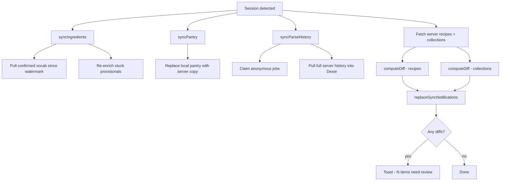

# Auth & Sync

How authentication works and how local data is reconciled with the server after sign-in.

---

## Authentication

RecipAI uses [better-auth](https://better-auth.com) with a Drizzle/Postgres adapter.

**Config:** `lib/auth/auth.ts`  
**Client:** `lib/auth/auth-client.ts`  
**API handler:** `app/api/auth/[...all]/route.ts`

### Providers

| Provider | Notes |
|---|---|
| **Google OAuth** | Requires `GOOGLE_CLIENT_ID` + `GOOGLE_CLIENT_SECRET`. |
| **Passkey (WebAuthn)** | Via `@better-auth/passkey`. |
| **Telegram OIDC** | Via `better-auth-telegram`. Requires bot token + OIDC credentials. |

Account linking is enabled with `allowDifferentEmails: true` — a user can link multiple providers to one account.

### Session gating in API routes

Use `requireSession()` from `lib/auth/require-session.ts`:

```ts
const authed = await requireSession();
if (authed.response) return authed.response; // 401
// authed.session is typed and non-null here
```

Never inline `auth.api.getSession` + a manual null check. Routes that intentionally allow anonymous access (e.g. `GET /api/ingredients`, `GET /api/parse-queue/[id]`) skip `requireSession` by design.

### Session state flag

`lib/auth/session-state.ts` exports `isSignedIn()` — a module-level boolean updated by `useSyncOnLogin` whenever the session changes. This lets `syncFetch` skip fire-and-forget calls when the user is not signed in, avoiding 401 noise from local-only writes.

---

## Sync on login (`hooks/use-sync-on-login.ts`)

When a session appears, `useSyncOnLogin` runs a full reconciliation:



### What each sync does

**Ingredients** — pulls `confirmed` vocabulary entries updated since the stored watermark (`localStorage.ingredientsSyncedAt`). Also re-triggers enrichment for any `provisional` entries stuck for more than 5 minutes with fewer than 3 retries.

**Pantry** — replaces the local pantry entirely with the server copy (no diff — server is authoritative for pantry).

**Parse history** — first claims any anonymous parse jobs into the user's account, then pulls the full server-side job list and merges into Dexie `parseHistory`.

**Recipes + collections** — fetches both sides and runs `computeDiff` (from `lib/db/sync-diff.ts`). Conflicts are where `updatedAt` differs between local and server. All diffs (server-only, local-only, conflicted) are written to Dexie `notifications` and the user is shown a toast to review them.

---

## Diff engine (`lib/db/sync-diff.ts`)

```ts
computeDiff<T extends { id: string; updatedAt: Date }>(
  local: T[],
  server: T[],
): SyncDiff<T>
```

Returns four buckets:

| Bucket | Meaning |
|---|---|
| `serverOnly` | Exists on server, not locally |
| `localOnly` | Exists locally, not on server |
| `conflicted` | Same id, different `updatedAt` |
| `identical` | Same id, same `updatedAt` |

Conflict resolution strategy: **last-write-wins is not applied automatically** — the user resolves each conflict via the Sync Review page (`app/[locale]/sync-review/`).

---

## Fire-and-forget sync on writes (`lib/db/supabase-sync.ts`)

Every local recipe write calls `syncCreate`, `syncUpdate`, or `syncDelete` via `syncFetch`. These are non-blocking — they fire and the UI doesn't wait.

`syncFetch` (`lib/sync-fetch.ts`) gates the call on `isSignedIn()`. If the user is not signed in, the call is skipped entirely. Network errors are silently swallowed (expected when offline). HTTP errors are captured by Sentry.

---

## Upload tokens

Image uploads during an anonymous parse session use a short-lived upload token (minted by `POST /api/parse-queue`, stored in Redis for 30 minutes). This lets the parse flow upload images without a session. Once signed in, the recipe and its images are already saved — no re-upload needed.
