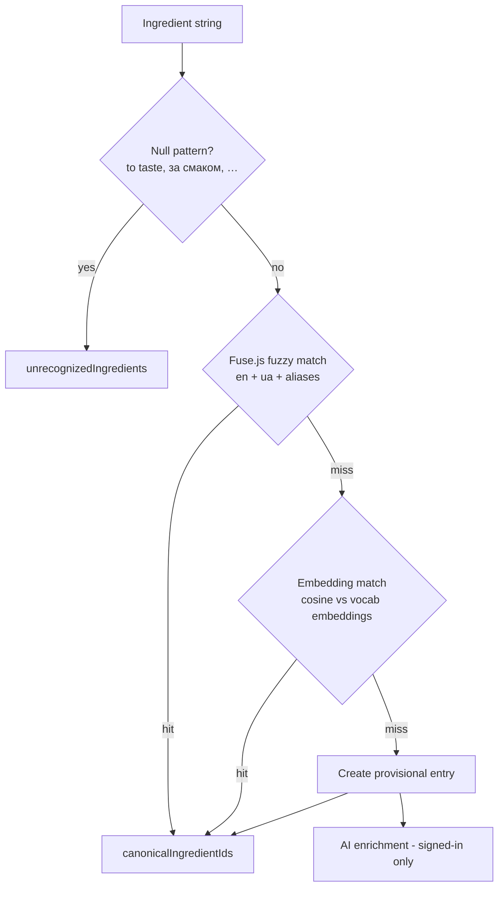

# Ingredient Vocabulary

How parsed ingredient strings are matched to a shared canonical vocabulary — fuzzy matching, on-device embeddings, and AI enrichment.

---

## Why a vocabulary

A parsed recipe arrives with free-text ingredient strings ("2 tbsp соєвого соусу", "soy sauce, to taste"). To power pantry matching, ingredient filters, and bilingual display (EN/UA), each string is resolved to a **canonical vocabulary entry**. The recipe stores the result as `canonicalIngredientIds` (plus `unrecognizedIngredients` for strings that can't be matched).

The vocabulary itself is the `ingredients` table — global, shared across all users, in both stores (Dexie locally, Postgres remotely). Each entry has `en`, `ua`, a category, alias arrays in both languages, and a status:

| Status | Meaning |
|---|---|
| `confirmed` | Curated or AI-enriched — participates in matching |
| `provisional` | Just created from an unmatched string — raw text, no aliases yet |
| `failed` | AI enrichment gave up (or the string isn't food) |

The initial dataset is curated JSON in `scripts/vocab/*.json`, merged into `scripts/ingredients-seed.json` and seeded into Postgres with `scripts/seed-ingredients.ts`.

---

## The matching pipeline (`lib/parse-recipe/normalize-ingredients.ts`)

`normalizeRecipeIngredients(recipeId, ingredients)` runs each string through four stages, cheapest first:

**1. Null patterns.** Phrases like "to taste" / "за смаком" / "for garnish" are not ingredients — they go straight to `unrecognizedIngredients`.

**2. Fuse.js fuzzy match.** A Fuse index (threshold 0.2) is built over every confirmed entry's `en`, `ua`, and both alias arrays, from the **local Dexie copy** of the vocabulary. Parenthesised text is stripped first. If the full string misses, each token longer than 3 chars is tried individually — handling phrases like "кетчупу Торчин для дітей" → "кетчупу" → ketchup — with a guard that the matched alias is at most 2 words, so a common word can't hit a long alias phrase.

**3. Embedding match.** Strings that survive Fuse are embedded on-device (see below) and compared by cosine similarity against precomputed vocabulary embeddings fetched from the static `public/vocab-embeddings.json`. A match is accepted only when the best score is **≥ 0.82** and leads the runner-up by **≥ 0.08** — ambiguous matches fall through rather than guess.

**4. Provisional + enrichment.** Anything still unmatched becomes a new provisional entry (deduplicated by raw text), written to Dexie immediately and upserted to Postgres via `POST /api/ingredients`. In parallel, `POST /api/ingredients/enrich` asks the AI to fill in the canonical name, Ukrainian translation, category, and aliases — on success the entry flips to `confirmed`.

The result is written to the recipe (`canonicalIngredientIds`, `unrecognizedIngredients`) in Dexie and fire-and-forget synced to Postgres.

### When it runs

- On every recipe save — both the review-form path (`components/recipe-form/use-recipe-save.ts`) and the direct parse-save path (`lib/db/save-parsed-recipe.ts`).
- On startup as a backfill — `useNormalizeOnStartup` (`lib/hooks/use-normalize-on-startup.ts`) re-normalizes any recipe that has ingredients but no `canonicalIngredientIds` yet (e.g. saved before this feature existed, or while matching was unavailable).

---

## The on-device embedding model

Embeddings are computed **client-side** — no API call, works offline once downloaded:

- **Model:** `Xenova/multilingual-e5-small` via `@huggingface/transformers`, running in a Web Worker (`lib/parse-recipe/embed-worker.ts`) so the main thread never blocks. E5 convention: queries are embedded with a `query:` prefix, the vocabulary with `passage:` (see `scripts/generate-vocab-embeddings.ts`).
- **Consent first.** The model is a ~117 MB download, so it is gated behind an explicit opt-in: `EmbedConsentModal` (mounted in `client-shell`) asks once per device and stores the answer in `localStorage` (`embedModelConsent`). Without consent, `getIngredientEmbeddings` throws `EmbedConsentRequired` and the pipeline silently skips stage 3.
- **Progress UX.** The worker reports download progress via `window` events; `use-embed-download.ts` exposes them as a hook (`idle` / `downloading` / `done`) for the notifications bell. After consent is granted the worker is pre-warmed so the download starts immediately.
- Embeddings are L2-normalized, so the dot product *is* the cosine similarity. Worker calls time out after 120 s.

`public/vocab-embeddings.json` is **static** — committed to git and shipped with each deploy, never updated from the server at runtime. Entries enriched to `confirmed` at runtime therefore participate in Fuse matching (after the next login pull) but not in embedding matching until the file is regenerated. To regenerate it run `bun scripts/generate-vocab-embeddings.ts` — note it reads `scripts/ingredients-seed.json`, not the live database; `bun scripts/test-vocab-coverage.ts` checks match quality.

---

## Signed-in vs anonymous

| Capability | Anonymous | Signed in |
|---|---|---|
| Vocabulary in Dexie (Fuse matching) | ✗ — vocab is pulled on login only | ✓ delta-synced via `GET /api/ingredients` |
| Embedding matching | ✓ (after model consent) — `vocab-embeddings.json` is a public static file | ✓ |
| Provisional creation (local) | ✓ | ✓ |
| Provisional upsert to server | ✗ | ✓ |
| AI enrichment | ✗ | ✓ (and stuck provisionals retry on login) |

So in practice an anonymous user's matching runs on embeddings alone, and entries they create stay raw until they sign in. The full rationale is in [Local Storage & Sync](local-storage-and-sync.md#ingredient-vocabulary-stays-local-for-anonymous-users).
