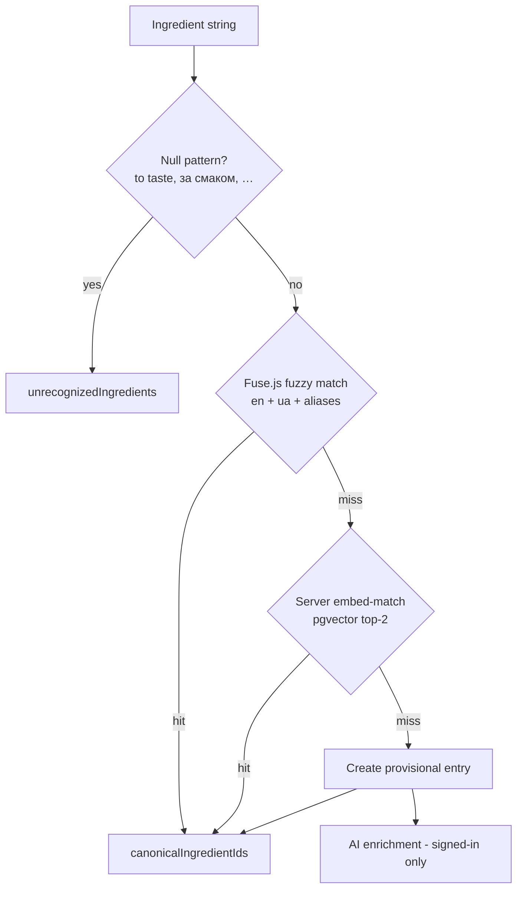

# Ingredient Vocabulary

How parsed ingredient strings are matched to a shared canonical vocabulary — local fuzzy matching, server-side embeddings, pgvector search, and AI enrichment.

---

## Why a vocabulary

A parsed recipe arrives with free-text ingredient strings ("2 tbsp соєвого соусу", "soy sauce, to taste"). To power pantry matching, ingredient filters, and bilingual display (EN/UA), each string is resolved to a **canonical vocabulary entry**. The recipe stores the result as `canonicalIngredientIds` (plus `unrecognizedIngredients` for strings that can't be matched).

The vocabulary itself is the `ingredients` table — global, shared across all users, in both stores (Dexie locally, Postgres remotely). Each entry has `en`, `ua`, a category, alias arrays in both languages, and a status:

| Status | Meaning |
|---|---|
| `confirmed` | Curated or AI-enriched — participates in matching |
| `provisional` | Just created from an unmatched string — raw text, no aliases yet |
| `failed` | AI enrichment gave up (or the string isn't food) |

The initial dataset is curated JSON in `scripts/vocab/*.json`, merged into `scripts/ingredients-seed.json` and seeded into Postgres with `scripts/seed-ingredients.ts`.

The confirmed vocabulary is also the **only** thing users can pick from when adding ingredients by hand — both the pantry and the recipe form select from it through the shared `components/ingredient-picker/` (no free-text entry). See [Curated ingredient input](decisions.md#curated-ingredient-input-tap-dont-type). Parsing still produces free-text strings, which is what the rest of this page is about.

---

## The matching pipeline (`lib/parse-recipe/normalize-ingredients.ts`)

`normalizeRecipeIngredients(recipeId, ingredients)` runs each string through four stages, cheapest first:

**1. Null patterns.** Phrases like "to taste" / "за смаком" / "for garnish" are not ingredients — they go straight to `unrecognizedIngredients`.

**2. Fuse.js fuzzy match.** A Fuse index (threshold 0.2) is built over every confirmed entry's `en`, `ua`, and both alias arrays, from the **local Dexie copy** of the vocabulary. Each parsed ingredient also carries an AI-normalized English head (`en`, e.g. "shredded mozzarella" → "mozzarella"), which is matched **first** — sidestepping modifier dilution and cross-lingual misses — then the raw `item`, then the `ua` hint. Parenthesised text is stripped first. If the full string misses, each token longer than 3 chars is tried individually — handling phrases like "кетчупу Торчин для дітей" → "кетчупу" → ketchup — with a guard that the matched alias is at most 2 words, so a common word can't hit a long alias phrase.

**3. Embedding match.** Fuse misses are batched to `POST /api/ingredients/embed-match`. The server embeds each query (the normalized `en` head when supplied, else `item`) through the configured provider chain, then asks Postgres for the two nearest confirmed vocabulary vectors using pgvector cosine distance. A match is accepted only when the best similarity is **≥ 0.88** and leads the runner-up by **≥ 0.02** — ambiguous matches fall through rather than guess. (These are calibrated for `multilingual-e5-small`; see the matcher comment in `lib/db/vocab-vector-search.ts` and `scripts/local/admin/calibrate`.) If every embedding provider is unavailable, the route returns HTTP 200 with `degraded: true` and null matches so normalization continues through provisional creation.

**4. Provisional + enrichment.** Anything still unmatched becomes a new provisional entry (deduplicated by raw text), written to Dexie immediately and upserted to Postgres via `POST /api/ingredients`. In parallel, `POST /api/ingredients/enrich` asks the AI to fill in the canonical name, Ukrainian translation, category, and aliases. Before confirming the entry, the route computes its `passage:` vector through the same server provider chain and stores it in Postgres. Embedding failure does not block enrichment: the row is confirmed with a null vector so a later repair pass can find it.

The result is written to the recipe (`canonicalIngredientIds`, `unrecognizedIngredients`) in Dexie and fire-and-forget synced to Postgres.

### When it runs

- On every recipe save — both the review-form path (`components/recipe-form/use-recipe-save.ts`) and the direct parse-save path (`lib/db/save-parsed-recipe.ts`).
- On startup as a backfill — `useNormalizeOnStartup` (`lib/hooks/use-normalize-on-startup.ts`) re-normalizes any recipe that has ingredients but no `canonicalIngredientIds` yet (e.g. saved before this feature existed, or while matching was unavailable).

---

## Server-side embedding and vector search

The browser no longer downloads or runs an embedding model. `lib/embed/` owns an ordered provider chain configured through `EMBED_PROVIDERS`:

- `local` loads `Xenova/multilingual-e5-small` in-process through `@huggingface/transformers`. The Pi uses this provider.
- `http:<base-url>` calls `<base-url>/api/embed` with `EMBED_SHARED_SECRET`. Vercel points to the Pi through the Cloudflare Tunnel.
- Providers are tried in order. Each HTTP provider has a 10-second timeout; failures are logged before the chain advances.
- If the chain is exhausted, `EmbedUnavailable` produces the explicit degraded normalization path described above.

E5 prefixes remain strict: parsed ingredient strings use `query:`, while confirmed vocabulary names use `passage:`. Both produce normalized 384-dimensional vectors in the same vector space.

### Vector storage

Vocabulary embeddings live only in Postgres, in `ingredients.embedding` (`vector(384)`). `GET /api/ingredients` deliberately omits them, so the device sync contains names, aliases, categories, and statuses but not vectors. The optional Dexie `VocabularyIngredient.embedding` property is dormant and retained only to avoid a client schema migration.

`nearestVocab` performs an exact top-two pgvector search over confirmed, non-null rows. The `<=>` operator returns cosine **distance**, so the query converts it to similarity with `1 - distance` before applying the `0.88` threshold and `0.02` runner-up gap. No ANN index is needed at the current vocabulary size.

---

## Signed-in vs anonymous

| Capability | Anonymous | Signed in |
|---|---|---|
| Vocabulary in Dexie (Fuse matching) | ✓ — pulled on startup via public `GET /api/ingredients` | ✓ delta-synced via the same route |
| Server embedding matching | ✓ — public `embed-match` route | ✓ |
| Provisional creation (local) | ✓ | ✓ |
| Provisional upsert to server | ✗ | ✓ |
| AI enrichment + passage embedding | ✗ | ✓ (and stuck provisionals retry on login) |

The vocab pull runs for everyone on startup (`useVocabSync` in `client-shell`), so anonymous users get local Fuse matching and can use the public server embed-match route. What they still miss is server-side persistence of the provisionals they create and AI enrichment of new entries — those stay login-gated. The full rationale is in [Local Storage & Sync](local-storage-and-sync.md#ingredient-vocabulary-stays-local-for-anonymous-users).
