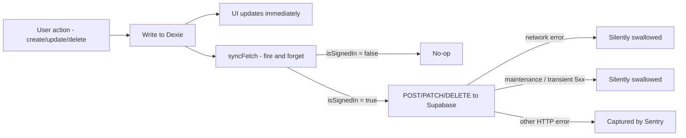

# Local Storage & Sync

How local data is stored in Dexie and reconciled with the server.

---

## The core idea

Dexie (IndexedDB) is the **local working store** — every recipe/collection read and write goes through it, so the UI never waits for the network and the app is usable without a session. Supabase Postgres is the **source of truth when signed in**: written opportunistically on each change and pulled by the reconciliation triggers below.

This means:
- Parsing a recipe works with no account (anonymous parse jobs, local-only save).
- Browsing, editing, and deleting recipes works fully offline.
- Syncing to the server is a fire-and-forget side effect — it cannot block the UI.

---

## Write path

The Dexie write always happens first. `syncFetch` (`lib/sync-fetch.ts`) checks `isSignedIn()` before sending — if the user is not logged in, the call is skipped entirely. If they are logged in but offline, the fetch fails silently. Maintenance 503s and transient upstream blips (502/503/504 — deploys, Pi restarts) are swallowed too; only other non-ok statuses reach Sentry.

---

## Read path (reconciliation — server wins)

When a session appears, `useSyncOnLogin` pulls the server state and reconciles it into local Dexie **silently — the server is authoritative**. The same single-flight reconciliation runs on manual pull-to-refresh and whenever the signed-in app returns to the foreground. There is no review screen and no user prompt.

The planner (`planReconcile` in `lib/db/reconcile-plan.ts`, built on `computeDiff`) sorts every recipe/collection by id into one of three actions, keyed on a per-item **`syncedAt` marker** — a device-local timestamp set once the item has round-tripped with the server (pulled or successfully pushed), never persisted to Postgres (the write-field whitelist strips it):

| Where the item is | Marker | Action |
|---|---|---|
| Server + device (differing, or identical-but-unmarked) | — | **Apply the server copy** to the device (server wins), setting `syncedAt` |
| Server only | — | **Pull to device**, setting `syncedAt` |
| Device only | `syncedAt` set | Previously synced → the server deleted it → **delete locally** |
| Device only | no `syncedAt` | Genuinely new local item → **push to the server** (insert-only), then set `syncedAt` |

The `syncedAt` marker is what disambiguates the two device-only cases — without it, a recipe the server deleted would look identical to a brand-new local one and get resurrected on every sync.

**Grace window.** A local item edited within `GRACE_WINDOW_MS` (90 s) is left untouched, so a still-in-flight local write is not overwritten by the server's pre-edit snapshot.

**Known tradeoff (accepted):** an offline edit to an *existing* recipe is overwritten when the device reconnects (server wins). Preserving offline changes — and reintroducing a review/merge decision only for the genuine device-changed-AND-server-changed case — is deferred future work. The `sync-review/` route and components are kept in the codebase (unreferenced) for that.

This is event-triggered pull reconciliation, not real-time sync. Changes made on another device appear after sign-in, a foreground refresh, or a manual pull-to-refresh; they do not stream between those triggers.

---

## Anonymous use

Everything works without an account:
- URL/video and photo parse jobs are created with `user_id = null` in `parse_jobs`.
- Results are saved to local Dexie only.
- Parse history is recorded in Dexie `parseHistory` locally.
- On login, anonymous jobs are **claimed** — `POST /api/parse-queue/claim` sets their `user_id` to the now-signed-in user, and the latest 100 server jobs are pulled into Dexie. Photo imports use the same job ID locally and on the server, so they participate in this flow even though their `url` is null.

### Ingredient vocabulary stays local for anonymous users

When a parsed ingredient has no match in the vocabulary, the app creates a **provisional** entry (`createProvisional` in `lib/parse-recipe/normalize-ingredients.ts`). For anonymous users this entry exists in local Dexie only:

- The server upsert (`POST /api/ingredients`) goes through `syncFetch`, which is a no-op when signed out.
- AI enrichment (`enrichIngredient` in `lib/parse-recipe/enrich-ingredient.ts`) early-returns when signed out, so the entry never gets translated, categorised, or aliased — it stays `provisional` with the raw parsed text as its name.
- The write routes (`POST /api/ingredients`, `POST /api/ingredients/enrich`) require a session. `GET /api/ingredients` (confirmed vocabulary without vectors) and `POST /api/ingredients/embed-match` are public.

This is **intentional**, not a bug: AI enrichment costs money per call, and the shared vocabulary is a curated dataset — both are reserved for signed-in users as a login incentive. Anonymous users **do** get the confirmed vocabulary in Dexie for local Fuse matching, and Fuse misses can use the public [server-side embedding matcher](ingredient-vocabulary.md#signed-in-vs-anonymous). Vectors stay in Postgres and never sync to the browser. What anonymous users miss is server-side persistence and enrichment of the new provisional entries they create.

The limitation heals on login: `syncIngredients` (`hooks/use-sync-on-login.ts`) re-submits stuck provisional entries to `/api/ingredients/enrich` (up to 3 retries, 5-minute backoff), so vocabulary created while anonymous gets enriched and confirmed once the user signs in.

---

## Service worker (`@serwist/next`)

The service worker (`app/sw.ts`, compiled to `public/sw.js`) caches:

- **Precached at install**: every build asset (JS, CSS, fonts), everything in `public/`, and the prerendered HTML shells for the bottom-nav destinations in both locales — `recipes`, `recipes/parse`, `pantry`, `profile`, `parse-history`, `login`. The shells carry a revision that changes on every build, so a deploy re-fetches them at install and the app version flips over atomically on activation; stale HTML can never point at chunks the new build dropped.
- **Images**: CacheFirst.
- **Page navigations**: NetworkFirst with a **3 s network timeout**, in a `pages` cache. The explicit `request.mode === "navigate"` matcher matters — `@serwist/next`'s default HTML rule keys off the request's `Content-Type` header, which navigations don't send, so without this rule page loads fall through to a NetworkFirst with no timeout and a bad connection waits on the network despite having a cached copy.
- **API responses**: NetworkFirst (from `defaultCache`).
- **Offline fallback**: `~offline` route served when a navigation fails with no cache hit.

The precache config lives in `next.config.ts`, not `app/sw.ts`. Note that passing `additionalPrecacheEntries` **replaces** `@serwist/next`'s automatic `public/` scan rather than extending it, so the config reproduces that scan itself — dropping it would un-precache `pwa-launch.html`, the installed PWA's `start_url`.

!!! note
    `public/sw.js` is generated by `bun run build` (webpack mode required). It is gitignored and should never be committed.

---

## Key constraint

**No real-time sync.** Changes on device A do not stream immediately to device B; device B must run one of the reconciliation triggers above. This is a deliberate trade-off: simpler code, no WebSocket dependency, works offline. If real-time sync is needed in the future it would require a Supabase Realtime subscription layer.
