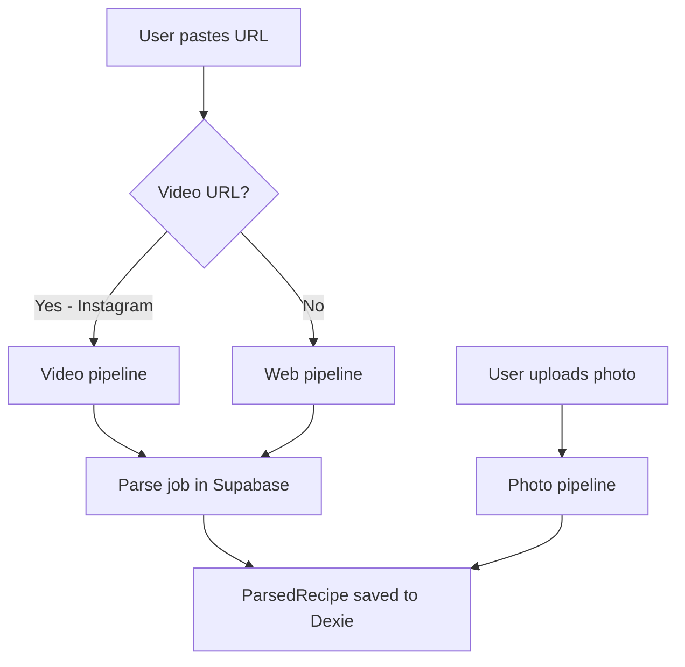
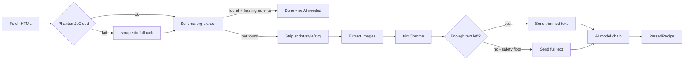
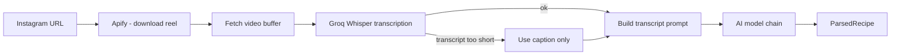
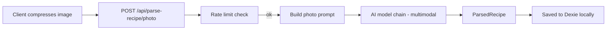
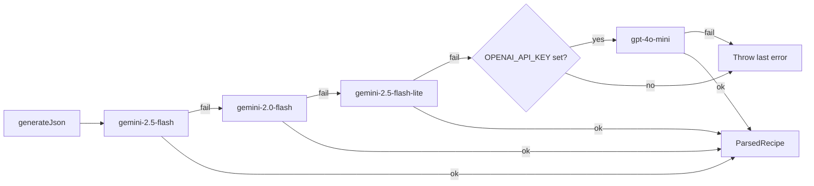
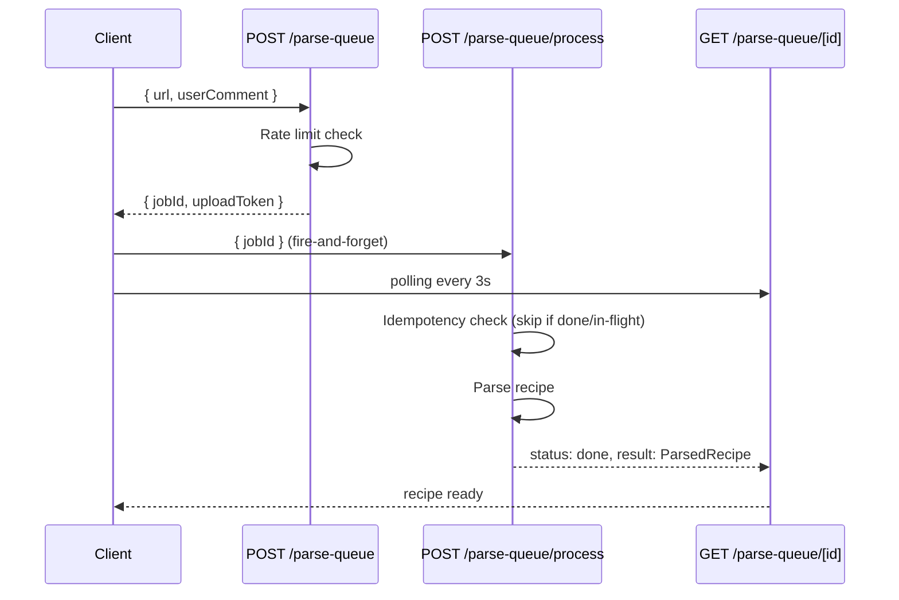

# Parse Pipeline

How RecipAI turns a URL or photo into a structured recipe.

---

## Overview

There are three entry paths:

---

## Web pipeline (`lib/parse-recipe/web.ts`)

**HTML trimming (`trimChrome`):** walks every `ul`, `ol`, `nav`, `header`, `footer`, and `div`. Blocks larger than 200 chars where more than 60% of the text is link text are removed as site chrome (menus, footers). A safety floor prevents gutting pages where the recipe content itself is link-dense: if the trimmed result is less than 300 chars or less than 10% of the original, the full text is used instead.

**Text limit:** the final text is sliced to 25,000 characters before being sent to the AI.

---

## Video pipeline (`lib/parse-recipe/video.ts`)

Currently supports **Instagram Reels only**.

Requires `GROQ_API_KEY`. If transcript is under 30 characters and no caption is available, parsing fails.

---

## Photo pipeline (`app/api/parse-recipe/photo/route.ts`)

Photos bypass the job queue entirely — parsing is synchronous.

The image is sent as a base64-encoded string alongside a text prompt. Both Gemini (via `inlineData`) and OpenAI (via `image_url` with a data URI) support this format. Photo history is recorded locally in Dexie `parseHistory` without a `url` field.

---

## AI model chain (`lib/ai.ts`)

All three pipelines funnel through the same model chain in `lib/ai.ts` (via the `callAiForRecipe` / `callAiForRecipePhoto` wrappers):

All Gemini models use `responseMimeType: "application/json"`. OpenAI uses `response_format: { type: "json_object" }`. The OpenAI fallback is only active when `OPENAI_API_KEY` is set — without it the chain ends at `gemini-2.5-flash-lite`.

---

## Parse queue (`app/api/parse-queue/`)

URL and video parses go through a job queue backed by Supabase `parse_jobs`.

**Idempotency:** if a job's `updatedAt` is less than 90 seconds old and its status is `processing`, a new `process` call is silently skipped. This prevents duplicate AI calls from repeated requests.

**Anonymous jobs:** jobs created without a session have `user_id = null`. On login, `POST /api/parse-queue/claim` adopts them into the user's account so they appear in the server-side history.

---

## Rate limiting (`lib/rate-limit.ts`)

AI parse requests (both URL and photo) share a single Redis fixed-window counter per caller:

| Caller | Limit |
|---|---|
| Anonymous (by IP) | 15 requests / hour |
| Signed-in (by user id) | 60 requests / hour |

The counter uses Redis `INCR` + `EXPIRE`. Rate limiting **fails open** — if Redis is unreachable the request proceeds and the error is captured by Sentry.

---

## Parse history (`lib/db/parse-history.ts`)

Every finished parse (done or failed) is recorded locally in Dexie `parseHistory`. The table is capped at 100 entries (oldest pruned). On login, the client syncs its local history with the server via the claim + pull flow in `useSyncOnLogin`.

---

## After parsing: ingredient normalization

A `ParsedRecipe` is not the end of the line — when it is saved, every ingredient string is matched against the canonical vocabulary (fuzzy match → on-device embeddings → provisional creation + AI enrichment) to populate `canonicalIngredientIds`. That pipeline has its own page: [Ingredient Vocabulary](ingredient-vocabulary.md).
