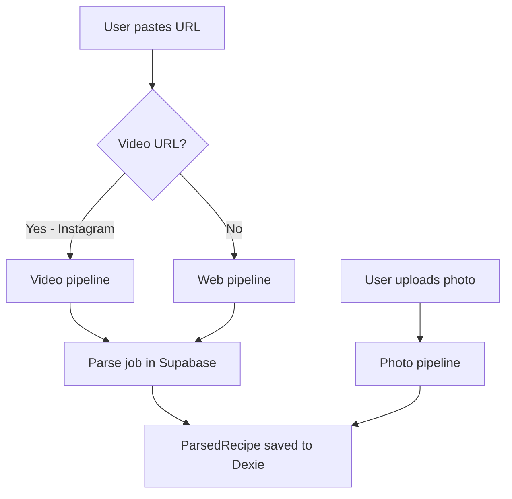
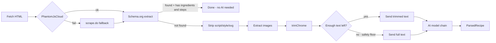
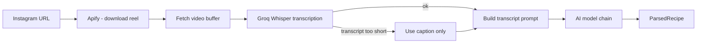
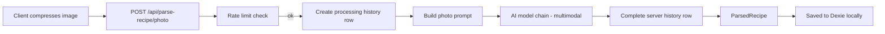
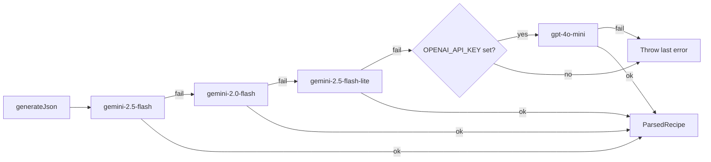
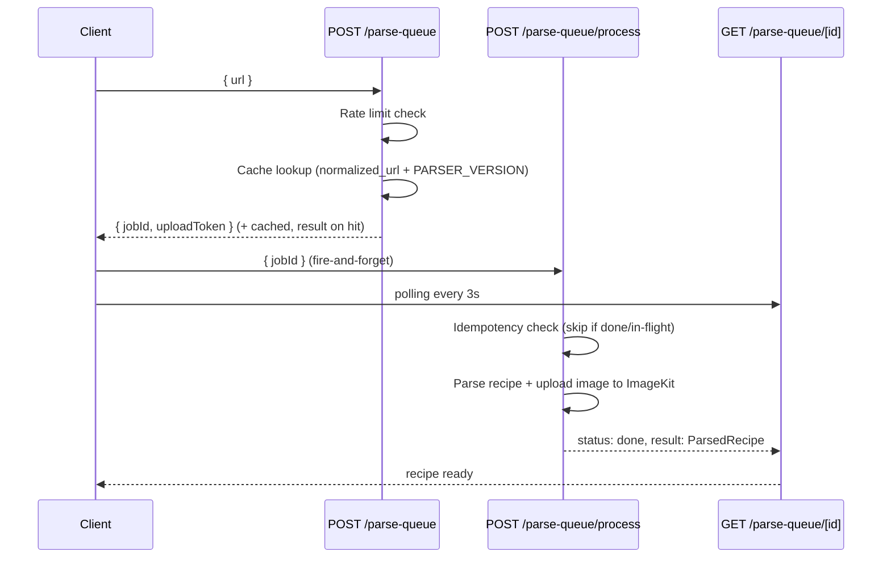
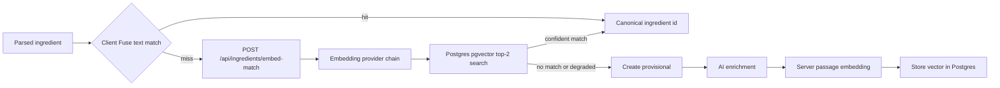

# Parse Pipeline

How RecipAI turns a URL or photo into a structured recipe.

---

## Overview

There are three entry paths:

---

## Web pipeline (`lib/parse-recipe/web.ts`)

**HTML trimming (`trimChrome`):** walks every `ul`, `ol`, `nav`, `header`, `footer`, and `div`. Blocks larger than 200 chars where more than 60% of the text is link text are removed as site chrome (menus, footers). A safety floor prevents gutting pages where the recipe content itself is link-dense: if the trimmed result is less than 300 chars or less than 10% of the original, the full text is used instead.

**Text limit:** the final text is sliced to 25,000 characters before being sent to the AI.

---

## Video pipeline (`lib/parse-recipe/video.ts`)

Currently supports **Instagram Reels only**.

Requires `GROQ_API_KEY`. If transcript is under 30 characters and no caption is available, parsing fails.

---

## Photo pipeline (`app/api/parse-recipe/photo/route.ts`)

Photos bypass queue processing — parsing is synchronous — but the route records the outcome in `parse_jobs` for history sync.

The image is sent as a base64-encoded string alongside a text prompt. Both Gemini (via `inlineData`) and OpenAI (via `image_url` with a data URI) support this format. Photo history is recorded locally in Dexie and server-side in `parse_jobs` without a `url`; the image itself is not retained.

---

## AI model chain (`lib/ai.ts`)

All three pipelines funnel through the same model chain in `lib/ai.ts` (via the `callAiForRecipe` / `callAiForRecipePhoto` wrappers):

All Gemini models use `responseMimeType: "application/json"`. OpenAI uses `response_format: { type: "json_object" }`. The OpenAI fallback is only active when `OPENAI_API_KEY` is set — without it the chain ends at `gemini-2.5-flash-lite`.

---

## Parse queue (`app/api/parse-queue/`)

URL and video parses go through a job queue backed by Supabase `parse_jobs`.

**Result cache.** Before enqueuing, `POST /parse-queue` normalizes the URL (`normalizeSourceUrl` — strips tracking params, collapses Instagram `reel`/`reels`/`p`/`tv` to one media id) and looks for a prior `done` job with that `normalized_url`, the current `PARSER_VERSION`, at least one ingredient, and at least one instruction. On a hit it inserts the new job **already `done`** with the cloned result and returns `{ cached: true, result }`, so the client renders it inline and the fire-and-forget `process` call no-ops. Bump `PARSER_VERSION` (`lib/parse-recipe/parser-version.ts`) to invalidate the cache after a prompt/model change.

**Image durability.** The process route uploads the recipe image to ImageKit at parse time (while the source URL is fresh) and stores the stable URL in `result`. Source CDN URLs — Instagram's especially — expire within hours, so without this a *cached* parse would render a broken image. Runs server-side, so anonymous parses get a durable image too.

**Non-recipes and incomplete extractions fail.** Every AI prompt first asks the model to return only `{"notRecipe": true}` when the input is not a recipe. The server also validates every URL, video, and photo result: a recipe must contain at least one ingredient **and** at least one instruction. Invalid results are treated as failures, never cached, and never fire a "recipe ready" notification. Each rejection emits a `parse_incomplete` log (Axiom, server-side, consent-independent) carrying `source` (`page`/`photo`), `reason` (`not_recipe` / `no_ingredients` / `no_instructions`), the `url` and `jobId` to reproduce the input, and — for under-extractions — the `title`, ingredient/instruction counts, and the full partial `result` the model returned (a failed job never persists its result, so this log is the only record of it). These failures remain **retriable** in parse history — an under-extraction can succeed on a second pass.

**Idempotency:** if a job's `updatedAt` is less than 90 seconds old and its status is `processing`, a new `process` call is silently skipped. This prevents duplicate AI calls from repeated requests.

**Two client-side pollers, one completion.** A job's status is polled from two places: `use-url-parse` (the inline parse page, which resumes a saved job on reload and renders the result in-page) and `use-parse-job-watcher` (mounted globally in `client-shell`, which catches completions after you navigate away and surfaces them as a toast + notifications-bell entry). When you start a parse and stay on the page the watcher owns it via the `parse-job-created` event; the inline poller only kicks in on a reload mid-parse. To stop both from running completion side effects (duplicate `parsedRecipes` rows, parse-history entries, telemetry, toasts) when they overlap, each terminal branch calls `claimJobCompletion(jobId)` from `lib/parse-job-completion.ts` — a synchronous, race-free guard that returns `true` for the first caller per job id and `false` for the rest, so exactly one poller wins.

**Anonymous jobs:** jobs created without a session have `user_id = null`. On login, `POST /api/parse-queue/claim` adopts them into the user's account so they appear in the server-side history.

---

## Rate limiting (`lib/rate-limit.ts`)

AI parse requests (both URL and photo) share a single Redis fixed-window counter per caller:

| Caller | Limit |
|---|---|
| Anonymous (by IP) | 15 requests / hour |
| Signed-in (by user id) | 60 requests / hour |

The counter uses Redis `INCR` + `EXPIRE`. Rate limiting **fails open** — if Redis is unreachable the request proceeds and the error is captured by Sentry.

---

## Parse history (`lib/db/parse-history.ts`)

Every finished parse (done or failed) is recorded locally in Dexie `parseHistory`. The table is capped at 100 entries (oldest pruned). On login, the client syncs its local history with the server via the claim + pull flow in `useSyncOnLogin`.

Failed URL entries expose a **Retry** action. It creates a new queue job and hands it to the existing background watcher; the original failed entry remains as history. Retry is hidden for **permanent** failures — private/restricted accounts, unsupported platforms, and videos with no extractable content (classified by `isRetriableFailure` in `friendly-parse-error.ts`) — because re-running the same URL cannot succeed. Photo entries never expose Retry because the source image is not retained.

Photo parsing remains synchronous, but each request also creates and completes a `parse_jobs` row with `url = null`. The client-generated job ID is reused for the local history entry, so anonymous photo parses can be claimed on login and later pulled on other devices just like URL/video history.

---

## After parsing: ingredient normalization

A `ParsedRecipe` is not the end of the line. When it is saved, each ingredient is matched against the canonical vocabulary to populate `canonicalIngredientIds`:

Fuse matching remains client-side against the confirmed names and aliases stored in Dexie. Only Fuse misses are sent to `POST /api/ingredients/embed-match`, where the server embeds the query through the configured provider chain and searches Postgres with pgvector. If every embedding provider is unavailable, the route returns a normal degraded response and the client continues through provisional creation instead of failing the recipe save.

AI enrichment also computes the confirmed canonical name's `passage:` embedding server-side. The former on-device model, worker, download consent, and local cosine scan have been removed. See [Ingredient Vocabulary](ingredient-vocabulary.md) for the full matching and enrichment flow.
