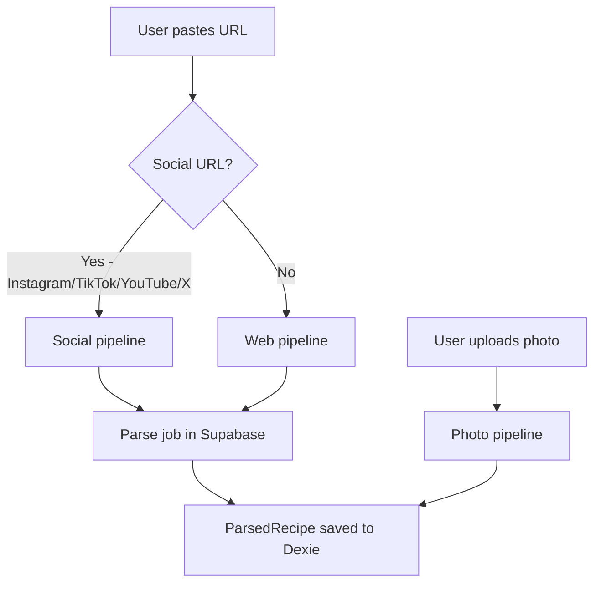
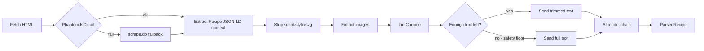
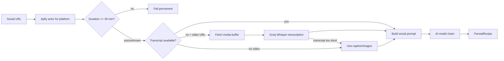
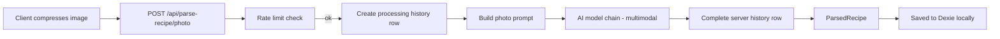
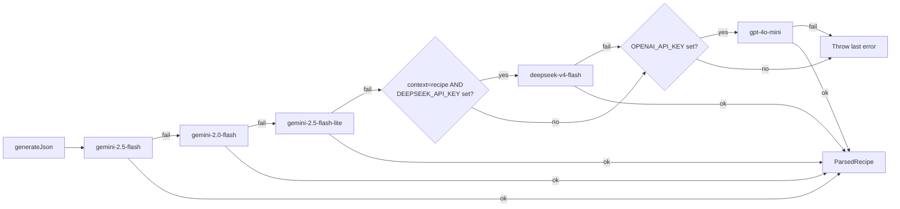
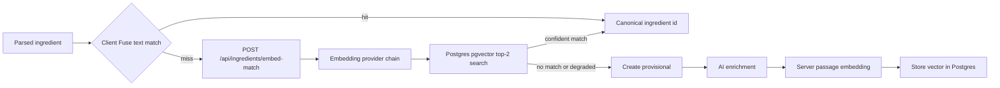

# Parse Pipeline

How RecipAI turns a URL or photo into a structured recipe.

---

## Overview

There are three entry paths:

---

## Web pipeline (`lib/parse-recipe/web.ts`)

Every URL parse goes through the AI. The former schema.org JSON-LD fast path was removed: a site's structured data can silently omit ingredients (14 of 16 on a real recipe), and a wrong recipe is worse than a slightly slower one. Recipe JSON-LD is retained only as labeled reference context beside the visible page text; it is never accepted directly as the result.

**HTML trimming (`trimChrome`):** walks every `ul`, `ol`, `nav`, `header`, `footer`, and `div`. Blocks larger than 200 chars where more than 60% of the text is link text are removed as site chrome (menus, footers). A safety floor prevents gutting pages where the recipe content itself is link-dense: if the trimmed result is less than 300 chars or less than 10% of the original, the full text is used instead.

**Text limit:** the final text is sliced to 25,000 characters before being sent to the AI.

**Scraper fallback is logged, not silent.** `parseWebRecipe` accepts an optional second `htmlFetcher` parameter (defaults to the PhantomJsCloud→scrape.do chain above), mirroring the `aiCaller` seam on the AI model chain below — no production caller passes one; it exists so `scripts/local/model-eval/` (gitignored) can substitute a local Playwright render instead of spending scraper credits on every provider it tests. When PhantomJsCloud fails and the chain falls through to scrape.do, the underlying PhantomJS error is logged (`log("warn", "phantomjs_fallback", { url, error })`) rather than discarded — a prior version swallowed it silently, which made a real PhantomJsCloud "out of credits" (402) failure indistinguishable from any other cause once scrape.do's own error was all that surfaced.

---

## Social pipeline (`lib/parse-recipe/video.ts`)

Supports Instagram posts/Reels, TikTok videos, YouTube videos/Shorts, and X/Twitter status posts.

Requires `APIFY_TOKEN`. `GROQ_API_KEY` is only required when a social actor returns downloadable video/audio without a transcript. Static posts can parse from caption and image context. Social videos with actor-reported duration over 30 minutes fail before transcription or AI; downloadable media with `Content-Length` over 24 MB fails before buffering. If a post has no caption, transcript, images, or video media, parsing fails.

---

## Photo pipeline (`app/api/parse-recipe/photo/route.ts`)

Photos bypass queue processing — parsing is synchronous — but the route records the outcome in `parse_jobs` for history sync.

The image is sent as a base64-encoded string alongside a text prompt. Both Gemini (via `inlineData`) and OpenAI (via `image_url` with a data URI) support this format. Photo history is recorded locally in Dexie and server-side in `parse_jobs` without a `url`; the image itself is not retained.

---

## AI model chain (`lib/ai.ts`)

All three pipelines funnel through the same model chain in `lib/ai.ts` (via the `callAiForRecipe` / `callAiForRecipePhoto` wrappers):

All Gemini models use `responseMimeType: "application/json"`. DeepSeek and OpenAI both use `response_format: { type: "json_object" }` via a shared `callOpenAiCompatibleJson` helper (same request shape, different base URL/model/key), with a 90s timeout on each — neither had an explicit timeout before, and DeepSeek's heavier `deepseek-v4-pro` tier was observed hanging past 2 minutes in side-by-side model testing (`scripts/local/model-eval`), which is why production uses the faster `deepseek-v4-flash` specifically.

DeepSeek is skipped entirely for `context: "photo"` (its chat API has no image input) and whenever `DEEPSEEK_API_KEY` is unset — the chain falls straight through to the OpenAI check in either case. The OpenAI fallback is only active when `OPENAI_API_KEY` is set — without either optional key, the chain ends at `gemini-2.5-flash-lite`.

`parseWebRecipe`, `parseVideoRecipe`, and `parseRecipeFromUrl` all accept an optional second `aiCaller` parameter (defaults to `callAiForRecipe`). No production caller passes one — it exists solely so the local model-comparison harness (`scripts/local/model-eval/`, gitignored) can run the exact same scrape/trim/prompt/validate pipeline against a different provider without duplicating that logic.

---

## Parse queue (`app/api/parse-queue/`)

URL and social parses go through a job queue backed by Supabase `parse_jobs`.

**Result cache.** Before enqueuing, `POST /parse-queue` normalizes the URL (`normalizeSourceUrl` — strips tracking params, collapses Instagram `reel`/`reels`/`p`/`tv` to one media id) and looks for a prior `done` job with that `normalized_url`, the current `PARSER_VERSION`, at least one ingredient, and at least one instruction. On a hit it inserts the new job **already `done`** with the cloned result and returns `{ cached: true, result }`, so the client persists it into `parsedRecipes` immediately and the fire-and-forget `process` call no-ops. Bump `PARSER_VERSION` (`lib/parse-recipe/parser-version.ts`) to invalidate the cache after a prompt/model change.

**Image durability.** The process route attempts to upload the recipe image to ImageKit at parse time, while the source URL is fresh, and stores the stable URL in `result` when that succeeds. Source CDN URLs — Instagram's especially — expire within hours, so without this a cached parse can render a broken image. The upload runs server-side for signed-in and anonymous jobs alike, but it is best-effort: on failure the process keeps the original source URL and still completes the parse — but it now **reports that failure to Sentry** (`ApiError.capture`) instead of swallowing it, because a swallowed failure silently persists an expiring URL. The server fetch (`uploadImageServer`, and the client-save path's `resolveFromUrl`) sends **browser-like headers** (`imageFetchHeaders`) — a real `User-Agent`, an image `Accept`, and an `instagram.com` `Referer` for `cdninstagram.com`/`fbcdn.net` hosts — because Instagram's CDN answers a bare Node fetch with a 403 or an HTML block page, which was leaving recent recipes stuck on the expiring source URL.

**Non-recipes and incomplete extractions fail.** Every AI prompt first asks the model to return only `{"notRecipe": true}` when the input is not a recipe. The server also validates every URL, social, and photo result: a recipe must contain at least one ingredient **and** at least one instruction. Invalid results are treated as failures and are never cached or announced as "recipe ready." Queued URL/social failures send a failure push when the enqueueing client supplied a push endpoint; the synchronous photo route returns its error directly and does not send push. Each rejection emits a `parse_incomplete` log (Axiom, server-side, consent-independent) carrying `source` (`page` / `social` / `photo`), `reason` (`not_recipe` / `no_ingredients` / `no_instructions`), the source URL when one exists, and an optional `jobId`. Under-extractions also include the title, ingredient/instruction counts, and the full partial `result` the model returned; a failed job never persists its result, so this log is the only record of it. These failures remain **retriable** in parse history — an under-extraction can succeed on a second pass.

**Idempotency:** if a job's `updatedAt` is less than 90 seconds old and its status is `processing`, a new `process` call is silently skipped. This prevents duplicate AI calls from repeated requests.

**Two client-side pollers, one completion.** A job's status is polled from two places: `use-url-parse` (the inline parse page, which resumes a saved job on reload and renders the result in-page) and `use-parse-job-watcher` (mounted globally in `client-shell`, which catches completions after you navigate away and surfaces them as a toast + notifications-bell entry). Both success paths persist the result to Dexie `parsedRecipes`, so the parse page card and the bell sheet point at the same durable row; saving, editing, or dismissing it from either surface removes it from both. To stop both pollers from running completion side effects (duplicate `parsedRecipes` rows, parse-history entries, telemetry, toasts) when they overlap, each terminal branch calls `claimJobCompletion(jobId)` from `lib/parse-job-completion.ts` — a synchronous, race-free guard that returns `true` for the first caller per job id and `false` for the rest, so exactly one poller wins.

**Anonymous jobs:** jobs created without a session have `user_id = null`. On login, `POST /api/parse-queue/claim` adopts them into the user's account so they appear in the server-side history.

**Telegram-notify hand-off.** A parse started **inside** the Mini App can't rely on web push (dead in the Telegram WebView — service workers are unregistered on launch), so without a bot ping it finishes silently and the user only sees the review toast the next time they open the app. When the "Telegram notifications" toggle is on (`lib/hooks/use-telegram-notify.ts` — default on for Telegram-connected users, per-device localStorage), the client sends `telegramNotify: true`; the enqueue route resolves the user's `telegramChatId` (`resolveTelegramChatId`) and stamps the job with it. That routes the in-app parse through the **same completion branch as the bot flow**: `process` saves the recipe server-side (`saveParsedRecipeForUser`, shared with the bot) and sends the "saved" bot message with the deep-link button — the review/save step is owned by the server. The client sees the echoed `telegramNotify: true` and skips its review/save/watcher/`process` path, but still polls in a **notify mode** that only surfaces the terminal state in-app (a success toast, or the failure error via the normal inline error path) — so a failed in-app parse isn't silent while the app is open; the saved recipe itself appears on the next sync/focus re-pull. A cache hit is saved inline in the enqueue route; a cache miss is kicked to `process` server-side so completion happens even if the client navigates away. `sendTelegramMessage` reports a non-2xx from the Telegram API to Sentry, so a dropped notification is diagnosable rather than silent.

---

## Rate limiting (`lib/rate-limit.ts`)

AI parse requests (both URL and photo) share a single Redis fixed-window counter per caller:

| Caller | Limit |
|---|---|
| Anonymous (by IP) | 15 requests / hour |
| Signed-in (by user id) | 60 requests / hour |

The counter uses Redis `INCR` + `EXPIRE`. Rate limiting **fails open** — if Redis is unreachable the request proceeds and the error is captured by Sentry.

---

## Parse history (`lib/db/parse-history.ts`)

Every finished parse (done or failed) is recorded locally in Dexie `parseHistory`. The table is capped at 100 entries (oldest pruned). On login, the client syncs its local history with the server via the claim + pull flow in `useSyncOnLogin`.

Failed URL entries expose a **Retry** action. It creates a new queue job and hands it to the existing background watcher; the original failed entry remains as history. Retry is hidden for **permanent** failures — private/restricted accounts, unsupported platforms, and videos with no extractable content (classified by `isRetriableFailure` in `friendly-parse-error.ts`) — because re-running the same URL cannot succeed. Photo entries never expose Retry because the source image is not retained.

Photo parsing remains synchronous, but each request also creates and completes a `parse_jobs` row with `url = null`. The client-generated job ID is reused for the local history entry, so anonymous photo parses can be claimed on login and later pulled on other devices just like URL/video history.

---

## Modifier & section extraction

All three prompts (`lib/parse-recipe/prompts.ts`) share one ingredient/instruction schema block and extract two display-only annotations alongside the recipe:

- **Modifiers.** The prompt lists the curated `PREPARATION_MODIFIERS` keys (`lib/parse-recipe/modifiers.ts`, injected via `modifierPromptList()` so prompt and enum never drift). The model chooses zero or one key, moves that preparation/state phrase out of `item`, and keeps the verbatim source in `original`. Saved ingredients use `modifiers[]`; users may add more keys in the edit form.
- **Sections.** The model emits short free-form labels (`"For the base"`, `"Sauce"`) with exact label reuse across ingredients and steps. `buildSavedRecipeShape()` converts those labels once into `Recipe.sections` and row-level `sectionId` references. Telegram-triggered saves and local parsed-recipe saves use the same helper.

Both are metadata for rendering only and are excluded from search, pantry, and vocabulary matching. Ingredient and step metadata lives in their existing JSON arrays, while the structured catalog uses the `recipes.sections` jsonb column added by migration `0023`. All parse paths produce the annotations in their single extraction call. Bump `PARSER_VERSION` (`parser-version.ts`) whenever the prompt changes so the result cache invalidates.

## After parsing: ingredient normalization

A `ParsedRecipe` is not the end of the line. When it is saved, each ingredient is matched against the canonical vocabulary to populate `canonicalIngredientIds`:

Fuse matching remains client-side against the confirmed names and aliases stored in Dexie. Only Fuse misses are sent to `POST /api/ingredients/embed-match`, where the server embeds the query through the configured provider chain and searches Postgres with pgvector. If every embedding provider is unavailable, the route returns a normal degraded response and the client continues through provisional creation instead of failing the recipe save.

AI enrichment also computes the confirmed canonical name's `passage:` embedding server-side. The former on-device model, worker, download consent, and local cosine scan have been removed. See [Ingredient Vocabulary](ingredient-vocabulary.md) for the full matching and enrichment flow.

**Normalization is client-side, so server-created recipes need catching up.** The Telegram bot writes its parsed recipe straight into Postgres (`parse-queue/process`) with **no** `canonicalIngredientIds` — normalization runs in the browser, not the queue worker. Any recipe pulled to a device without canonical ids is normalized there: `normalizePendingRecipes()` (`lib/db/normalize-pending-recipes.ts`) runs on startup (`useNormalizeOnStartup`) **and after every sync**, and the deep-link owner-pull (`pullOwnRecipe`) kicks it off for the one recipe it fetches. The result is written back to Dexie and pushed to the server, so other devices pull the already-normalized copy. `normalizeRecipeIngredients` guards against two of these passes running for the same recipe at once (which would create duplicate provisionals).
